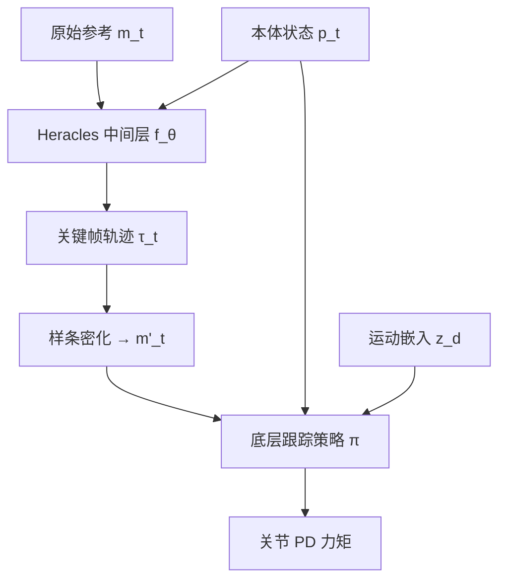

# 消化笔记：Heracles（arXiv:2603.27756）

**原文**：[Heracles: Bridging Precise Tracking and Generative Synthesis for General Humanoid Control](https://arxiv.org/abs/2603.27756)  
**PDF**：[https://arxiv.org/pdf/2603.27756](https://arxiv.org/pdf/2603.27756)  
**项目页**：[https://heracles-humanoid-control.github.io/](https://heracles-humanoid-control.github.io/)（代码尚未发布）

## 一句话

在**高层参考动作**与**底层物理跟踪策略**之间插入**状态条件的扩散/流匹配中间层**：状态接近参考时近似恒等映射（保持跟踪精度），偏离大时生成短时可行恢复关键帧，**无需显式模式切换**。

## 问题与动机

- **纯跟踪**（GMT、SONIC、HOVER 等）：名义条件下零样本效果好，但大扰动时盲目减小 kinematic 误差 → 僵硬、非人化、常不可逆跌倒。  
- **纯生成**（BFM 等）：动作更自然，但难以满足严格时空跟踪精度。  
- **显式混合/状态机**：跟踪与恢复模块割裂，过渡不自然。

Heracles 主张：**实时物理状态**应隐式决定中间层是「透传参考」还是「合成新轨迹」。

## 系统架构

两层：

1. **状态条件生成中间层**（较低频重规划）  
2. **通用物理跟踪策略**（高频执行，类似大规模 mimic tracker）

## 方法要点

### 3.1 问题表述

- 名义：跟踪 `m_t` 与 `p_t` 的偏差。  
- OOD：仍强行跟踪 `m_t` → 短视修正。  
- 学习映射 `τ_t = f_θ(p_t, m_t) ∈ R^{K×D}`（K 个关键帧）。  
- 近参考流形：`f_θ ≈ identity`；大偏差：合成**物理可行**的回归轨迹。

### 3.2 流匹配中间层

**几何残差参数化（式 4–5）**

- 基线 `β_{t,k} = p_t`（各关键帧锚在当前状态）  
- 只预测残差 `r_t`，`τ_t = β_t + r_t`  
- 近名义时残差小 → 近似透传参考；大偏差时残差承载恢复运动  

**条件流匹配（式 6–7）**

- 线性插值路径 `x_t = (1-t)x_0 + t x_1`，`x_0` 为归一化真值残差，`x_1` 为高斯噪声  
- 速度场回归损失 `L_vel`；条件 `c_t = [p_t, m_t]`  
- 推理：Euler 积分 ODE；首 token inpainting 锚定当前状态（式 8）  

**重规划**

- 固定时间窗 Δt、执行间隔 `N_exec`；长时恢复靠**滚动重规划**而非一次预测全长。  
- **方向热启动**（式 9–10，SDEdit 思想）：从 `p_t` 指向 `m_t` 的线性插值残差加噪初始化，减少 ODE 步数。

密化：关节位置三次样条，根姿态 slerp → 写入 tracker 参考缓冲。

### 3.3 底层通用跟踪器

**观测（式 11–12）**

- `p_t`：投影重力、根角速度、关节位/速（相对默认姿态）、上一拍动作  
- `m_t`：参考根线/角速度、参考关节位、根姿态误差 Rot6D  
- `z_d`：FSQ 量化的离散运动 token（高层语义）

与本 demo **Tracking** 策略对比：

| Heracles 论文 | 本仓库 `tracking_policy_latest.json` |
|---------------|--------------------------------------|
| 单步 `m_t` | 多 future_steps 的 `TrackingCommandObsRaw` 等 |
| 中间层改写 `m'_t` | 直接从 `motions/*.json` 读参考 |
| 623 维量级策略输入 | `in_shapes` 含 `[1,623]` |
| Compliance / BootIndicator | 有 `ComplianceFlagObs`、`BootIndicator` |

本 demo 体现的是**跟踪器范式**，尚未接入 Heracles 的 `f_θ` 中间层。

**训练**：MDP 折扣回报，奖励含跟踪精度与物理正则；大规模 MoCap + 改进网络（论文称相对 SONIC/GMT 的 tracker 增强）。

## 与相关工作的定位（§2 摘要）

- **跟踪系**：DeepMimic → GMT → SONIC → OmniXtreme；强模仿、弱 OOD 恢复。  
- **URL/BFM**：无参考探索，自然但难精确跟踪。  
- **混合**：ASE、VMP、AMOR、ADD 等多在训练期耦合先验，**实时状态偏差难以重塑生成目标**。  
- **Heracles 差异**：中间层在**闭环**中按 `p_t` 调制输出，隐式统一跟踪与生成恢复。

## 实验结论（摘要）

- 真机部署：极端扰动下出现**多样化、人化**恢复，而非单一 termination-trick 策略的刻板动作。  
- 名义条件下保持接近零样本跟踪保真度。

## 与本 Sim2Sim Demo 的关系

| 能力 | 本仓库现状 |
|------|------------|
| 底层 motion tracking | ✅ `g1-tracking-latest` + LAFAN/自定义 motions |
| 顺应性 / 阈值 UI | ✅ Compliance 滑条（论文 tracker 扩展方向） |
| Flow Matching 中间层 | ❌ 未集成（无 ONNX / 无重规划循环） |
| 运动 token `z_d` | ❌ 未暴露 |

**若未来集成 Heracles**：需在浏览器或边缘侧增加低频 `f_θ` 推理，将输出密化后写入与 `trackingHelper.js` 兼容的参考缓冲；跟踪 ONNX 可复用现有管线。

## 与 SDAMP 的对比（简表）

| 维度 | Heracles | SDAMP（2605.18611） |
|------|----------|---------------------|
| 架构 | 两层（生成 + 跟踪） | 单层 actor |
| 恢复 | 扩散合成关键帧 | AMP 恢复判别器 + 重力门控 |
| 跟踪精度 | 显式保留参考跟踪通道 | 速度条件 locomotion 判别器 |
| 本 demo | 仅底层 tracking | 完整 AMP 走跑起身 ONNX |

## 参考资料索引

见 [`../sources.json`](../sources.json) 中 `heracles-2603.27756` 与 `related` 列表（DeepMimic、ASE、VMP、Flow Matching 等）。
