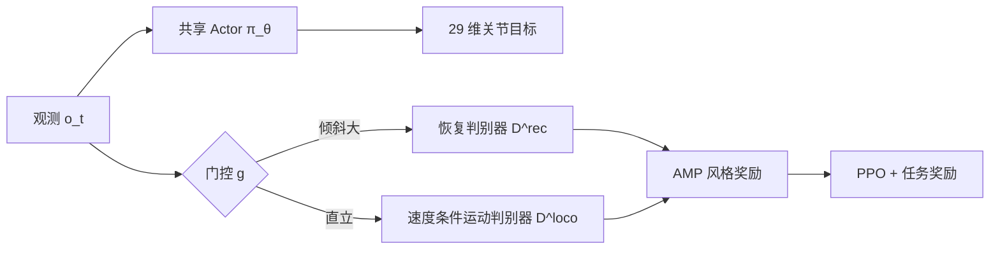

# 消化笔记：SDAMP（arXiv:2605.18611）

**原文**：[Unified Walking, Running, and Recovery for Humanoids via State-Dependent Adversarial Motion Priors](https://arxiv.org/html/2605.18611v1)  
**机构**：香港大学  
**硬件验证**：Unitree G1

## 一句话

用**单一 RL 策略**在真机上实现行走、跑步与倒地起身，部署时**无需模式切换**；训练时用**状态相关门控**在「起身判别器」与「速度条件运动判别器」之间切换 AMP 奖励。

## 问题与动机

传统方案用有限状态机在走/跑/起身模块间切换，过渡需手工调参、边界易脆。标准 AMP 使用**全局**参考分布，难以同时覆盖周期 locomotion 与多接触起身动力学。

## 方法结构



### 观测与动作

| 项 | 内容 |
|----|------|
| 单帧观测 | 机体角速度、投影重力、速度指令、相对关节位/速、上一拍动作 → **96 维** |
| 历史 | 4 帧拼接 → **384 维** 策略输入 |
| 动作 | 29 维目标关节位置，底层 PD 跟踪 |

与本 demo `amp_policy_walk_run_getup.json` 中 `obs_config`（`RootAngVelB`、`ProjectedGravityB`、`Command`、`JointPos`、`JointVel`、`PrevActions`，`history_length: 4`）一致。

### 任务奖励（式 1）

速度跟踪 + 平滑 + 姿态稳定 − 能耗 − 跌倒惩罚，与常规 locomotion RL 一致。

### 状态相关运动先验（核心）

- **两个判别器**  
  - `D^rec`：仅 fall-recovery 参考转移  
  - `D^loco`：walk + run 参考，并以归一化速度指令 `v̂_t ∈ [0,1]` 为条件，在 walk/run 分布间插值采样  

- **门控（式 5，仅训练时）**  

  ```
  z_t = rec   若 |g_z + 1| > 0.6   （约 37° 倾角）
  z_t = loco  否则
  ```

  `g_z` 为投影重力在机体 z 分量；直立时 `g_z ≈ -1`。浏览器侧 `ProjectedGravityB` 节点即该信号的可视化入口。

- **AMP 奖励（式 3–4）**  
  按 `z_t` 选用对应判别器输出，总奖励 `R^total = R_task + λ_amp R_AMP`，`λ_amp = 0.5`。

### 参考动作（§III-D）

三条 LAFAN1 片段经 IK retarget 到 G1：

| 片段 | 用途 |
|------|------|
| walk1_subject1 | 低速 locomotion 参考 |
| run1_subject2 | 高速 locomotion 参考 |
| fallAndGetUp2_subject2 | 仅训练 `D^rec` |

`D^loco` 更新时以概率 `(1−v̂_t)` 采 walk、以 `v̂_t` 采 run。

本仓库 `public/examples/checkpoints/g1/motions.json` 已包含上述三条（另有多条 LAFAN/其它动作供 Tracking 演示）。

## 实验要点

- **仿真**：Isaac Lab + PPO + AMP，`λ_amp=0.5`，三层 MLP。  
- **部署**：导出 ONNX，**50 Hz**，无运行时门控或模式变量。  
- **速度范围**：正常模式 vx ∈ [-0.5, 1.0] m/s；快速模式 [-1.5, 3.0] m/s（需操作员显式切换，安全考虑）。  
- **起身**：俯卧/仰卧均可恢复；硬件视频展示 recovery → walk → run 连续序列。

## 与本 Sim2Sim Demo 的关系

| 论文概念 | 本仓库 |
|----------|--------|
| 统一走跑起身策略 | 策略 `g1-amp-walk-run-getup`，ONNX `model_60000.onnx` |
| 训练来源 | `onnx.source.training_repo`: AMP_mjlab |
| 投影重力门控信号 | 观测块 `ProjectedGravityB`（流程图可查看实时 gx,gy,gz） |
| 速度指令 | UI 滑条 `Command` → vx/vy/yaw；对应 `v̂_t` 条件化思想 |
| 击倒测试 | `Demo.vue` 中「击倒测试」对骨盆施加冲击，用于 sim2sim 起身行为粗测 |
| 三条 LAFAN 参考 | `motions/` 下同名 JSON（Tracking 索引中亦可播放） |

**注意**：网页端只运行**已导出的 actor ONNX**，不包含训练时的双判别器或门控逻辑；起身/走/跑能力已烘焙进策略权重。判别器与门控属于训练期正则，理解论文有助于解释为何少量参考片段即可覆盖三态行为。

## 与 Heracles 的对比（简表）

| 维度 | SDAMP | Heracles |
|------|-------|----------|
| 统一方式 | 单策略 + 训练时双判别器门控 | 分层：生成中间层 + 跟踪底层 |
| 恢复机制 | AMP 恢复先验 + 重力门控 | 状态条件 Flow Matching 合成关键帧 |
| 部署 | 单 ONNX，无中间层 | 中间层重规划 + 高频 tracker |
| 本 demo | ✅ 已集成 AMP 策略 | ⚠️ 仅底层 Tracking，无扩散中间层 |

## 开放问题 / 后续

- 是否公开与 2605.18611 完全对齐的训练代码与门控实现（当前 demo 链到 AMP_mjlab）。  
- 快速模式与网页速度滑条上限是否需与论文范围对齐标注。  
- Sim2sim 击倒测试与真机俯卧/仰卧恢复的可比性文档化。
