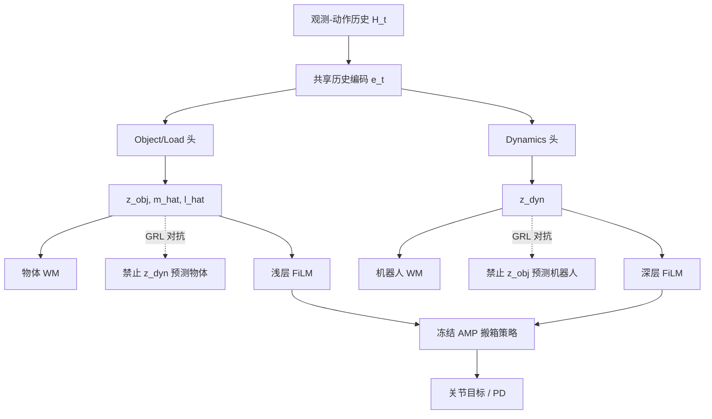

# SplitAdapter 消化笔记

> **条目 ID**: `splitadapter-2606.03297`  
> **消化日期**: 2026-06-04  
> **原始资料**: [`sources/splitadapter-2606.03297/`](../sources/splitadapter-2606.03297/)

## 一句话

在**冻结**的 PhysHSI 式搬箱策略上，用**负载分支 + 动力学分支**两条历史上下文、**拆分世界模型**与 **GRL 解耦**，经**层级 FiLM** 注入策略，使 Unitree G1 在 2–6 kg、0–60 cm 拾放高度下 sim2sim 与零样本真机 Full-task 成功率显著提升，**6 kg 重载搬运/放置**收益最大。

## 为何需要「拆分」而不是一个 adapter 潜变量

| 现象 | 单潜变量 adapter 的问题 | SplitAdapter 做法 |
|------|-------------------------|-------------------|
| 箱子变重 | 需要更大接触力、躯干/步态协调 | \(z_{\mathrm{obj}}\) + 显式 \(\hat{m},\hat{\ell}\) + 物体 WM |
| 电机/地面/模型误差 | 同样历史里混入「推不动、晃」 | \(z_{\mathrm{dyn}}\) + 机器人 WM |
| 两者在历史里纠缠 | 重载时搬运阶段易倒、放不稳 | GRL 禁止跨分支预测对方目标 |

与本仓库关系：当前 Demo 以固定 ONNX policy 为主；若未来做 **sim2real 残差/适配**，可参考「**不要把所有环境因子塞进一个 history embedding**」的设计。

## 架构速览（实现视角）



## 实验数字（便于选型对比）

### Sim-to-sim（MuJoCo，Full-task / 90）

- Base PhysHSI: **71**
- AnyAdapter 式 WM-FiLM: **75**
- SplitAdapter: **86**（Lift-up 90/90 与若干消融持平）

### 真机 G1（Full-task / 27，零样本）

- Base: **16 (59.3%)**
- SplitAdapter: **26 (96.3%)**

**解读**: Lift-up 各方法差距不大；差距集中在 **抬起之后的运输与放置**——与本站若集成「重载 motion / 力控」时的验收指标一致（不要只看能否蹲下抬起）。

## 和本仓库其他能力的对照

| 维度 | SplitAdapter | 本仓库现状 |
|------|--------------|------------|
| 机器人 | Unitree G1 真机 + 仿真 | G1 MJCF + ONNX tracking/AMP/parkour |
| 仿真 | Isaac 训练 → MuJoCo 验证 | 浏览器 MuJoCo WASM sim2sim |
| 任务 | 刚性箱体 loco-manipulation | 跟踪 motion、AMP 走跑起身、跑酷 |
| 自适应 | 在线双分支 + WM + FiLM | 无（policy 权重固定） |
| 公开代码/权重 | 项目页 Code 占位 | — |

## 后续可跟进（非本次 PR 范围）

1. 关注 https://splitadapter.github.io/ 是否发布 **代码与 checkpoint**。
2. 若权重开放，评估能否在现有 G1 场景上挂接 **adapter 推理头**（ONNX 或多 session）。
3. 与 **PhysHSI**、**AnyAdapter** 论文对照，统一本知识库条目间的引用关系。
4. 控制面板可考虑增加 Paper 外链（与现有 Parkour Paper 按钮同模式），待用户确认产品需求。

## 引用

```bibtex
@misc{kang2026splitadapterloadawarehumanoidlocomanipulation,
  title={SplitAdapter: Load-Aware Humanoid Loco-Manipulation via Factorized Adaptation},
  author={Jeonguk Kang and Hanbyel Cho and Sanghyun Kang and Donghan Koo},
  year={2026},
  eprint={2606.03297},
  archivePrefix={arXiv},
  primaryClass={cs.RO},
  url={https://arxiv.org/abs/2606.03297}
}
```
