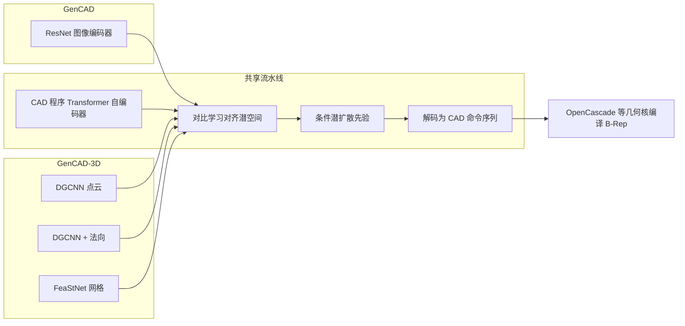

# GenCAD 与 GenCAD-3D 对照

## 一句话定位

| 工作 | 条件输入 | 核心输出 | 典型场景 |
|------|----------|----------|----------|
| **GenCAD** (2024/2025) | 2D CAD 渲染图（灰度 448×448） | 参数化 CAD 命令序列（CAD 程序） | 看图生成/检索 CAD |
| **GenCAD-3D** (2025) | 点云 / 点云+法向 / 网格 | 同上 | 扫描件逆向工程、复杂几何重建 |

二者共享「**CAD 程序即语言序列** + **对比学习对齐潜空间** + **条件潜扩散先验** + **Transformer 解码**」范式；GenCAD-3D 将 GenCAD 的图像编码器扩展为三维几何编码器，并引入 **SynthBal** 缓解 DeepCAD 数据的长尾复杂度失衡。

## 架构对照（四阶段）

## 数据与资源

| 项目 | 训练数据基础 | 公开资源 |
|------|--------------|----------|
| GenCAD | DeepCAD 过滤后约 16.8 万可编译 CAD；约 84 万渲染图 | Google Drive 数据集与 checkpoint |
| GenCAD-3D | DeepCAD 扩展至多模态（点云/网格等）；SynthBal 合成增强 | HuggingFace 数据集（多 split，合计约 240GB+）与权重 |

## 能力与指标亮点

- **GenCAD**：图像条件生成在 COV/MMD/JSD 等指标上优于 DeepCAD、BrepGen 等基线；图像检索 CAD 程序准确率约为图像-图像检索的 **15 倍以上**。
- **GenCAD-3D**：SynthBal 将无效 CAD 生成率从约 **3.44%** 降至 **0.845%**；高复杂度序列上 Chamfer 中位误差最多约降 **89%**；网格编码器相对纯点云在命令准确率上最高约 **15%** 相对提升。

## 命令与表示（共同约束）

当前公开实现均基于 DeepCAD 风格 **sketch-and-extrude** 子集：

- 草图：`Line`、`Arc`、`Circle`
- 三维：`Extrude`（及序列结束符等）
- 数值编码：固定 **60×17** 矩阵（第 1 列为命令类型，后 16 列为参数）

架构本身不绑定命令种类，可扩展至 revolve、fillet 等工业命令（论文中明确说明）。

## 代码仓库训练入口（速查）

**GenCAD**（单仓库 `train_gencad.py`）：

- `csr` — Command Sequence Reconstruction（自编码器）
- `ccip` — Contrastive CAD-Image Pretraining
- `dp` — Diffusion Prior

**GenCAD-3D**（分模块）：

- `autoencoder.gencad.train_gencad`
- `contrastive.train_contrastive_model`
- `diffusion.train_cond_diffusion`

## 延伸阅读

- DeepCAD：无条件 CAD 序列生成基线 — https://github.com/rundiwu/DeepCAD
- 官方消化文档：[digest-gencad.md](./digest-gencad.md)、[digest-gencad-3d.md](./digest-gencad-3d.md)
